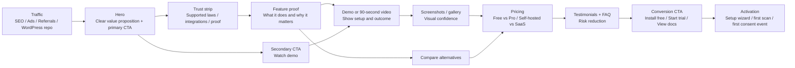
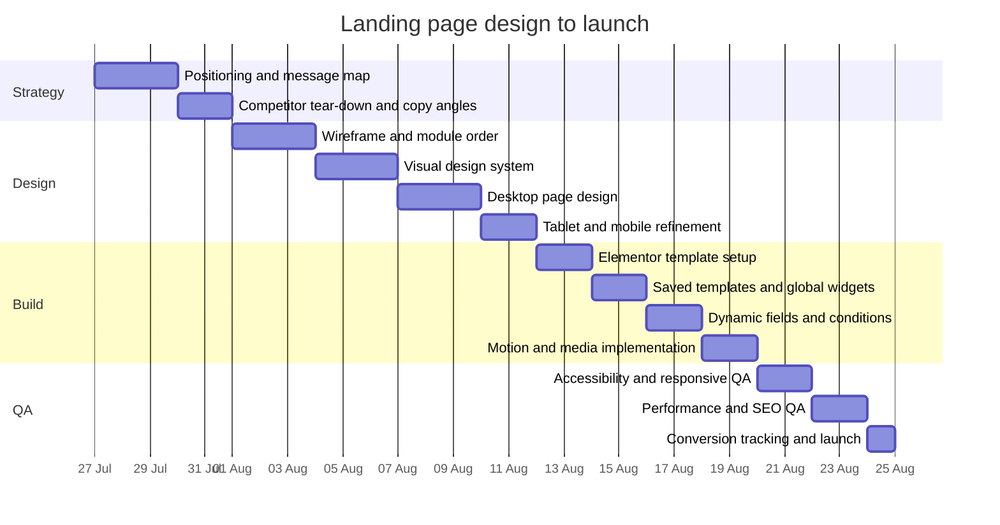

# Elementor Landing Page Strategy for a WordPress Plugin

## Executive summary

This report assumes the plugin is a **WordPress consent-management / cookie-consent / Google Consent Mode plugin** because the plugin name supplied in the uploaded asset strongly suggests that category. If the actual plugin category is different, the **Elementor architecture, design system, modular page model, conversion funnel, and delivery plan below still apply**, but the market table should be swapped for the correct competitor set. That assumption matters because this plugin category sits inside a growing global consent-management market that leading market trackers now size at roughly **$1.0 billion in 2025 to about $1.2 billion in 2026**, with continued double-digit growth expected through the early 2030s. citeturn0search4turn0search1turn0search16

The category is attractive but crowded. Official WordPress and vendor sources show strong adoption across leading competitors: **Complianz 1M+ active installs**, **CookieYes 1M+**, **GDPR Cookie Compliance by Moove 300k+**, **iubenda 200k+**, **Cookiebot 100k+**, and **Real Cookie Banner 100k+** at minimum, before counting premium-only products such as Borlabs or premium licence bases outside WordPress.org. That implies a **minimum visible WordPress install base of 2.7M+ across major CMP plugins**, even allowing for overlap. The market is therefore validated, but differentiation must be sharp. citeturn1search12turn2search8turn13search1turn12search11turn12search13turn13search10

The most defensible landing-page position is **not** “another cookie banner.” It is: **the fastest, cleanest, most WordPress-native way to get compliant consent signals live without enterprise bloat or pageview-tax pricing**. Competitors mostly split into two camps: **self-hosted annual licence products** such as Complianz, Moove, Real Cookie Banner, WebToffee, and Borlabs, and **SaaS/pageview-priced tools** such as CookieYes, Cookiebot, and iubenda. Your page should make that split explicit because it maps directly to buyer anxieties: ownership of consent data, pageview caps, performance overhead, setup time, Google Consent Mode, and WooCommerce / GTM compatibility. citeturn6view0turn16search0turn17search0turn11view1turn29search1turn15view0turn14search2turn6view3

Elementor is a strong fit for this sort of landing page because its current feature set supports **responsive editing, nested containers, reusable templates, global widgets, anchor links, dynamic content, and display conditions**. Those capabilities make it practical to build a landing page whose sections can be reordered, duplicated, hidden, and audience-swapped without turning the page into a maintenance burden. citeturn23view2turn23view3turn23view4turn31view0turn31view1turn23view0turn23view5



## Working assumptions and market frame

### Product and audience assumptions

Because the plugin name, context, and competitor landscape point most plausibly to a consent-management plugin, this report frames the product as a **lightweight WordPress CMP** for site owners who need cookie consent, consent logs, script blocking, geo-aware behaviour, and Google Consent Mode support. That framing is commercially sensible because Google states that Consent Mode interacts with a CMP rather than replacing it, and because Google’s EEA and UK ad-policy updates materially increased the practical need for CMP-backed consent workflows. citeturn28search8turn28search2turn28search6turn28search26

For **B2B**, the core buyer is a marketer, e-commerce manager, agency, or ops lead who needs auditability, multi-site licensing, predictable pricing, support for GTM / GA4 / ads, and fewer implementation steps. For **B2C / prosumer**, the core buyer is a site owner, creator, blogger, or small-store operator who wants something simple, affordable, and visually clean. Your landing page should therefore support **two message layers without changing the design system**: one version that sells **compliance operations and scale**, and one that sells **simplicity and peace of mind**. That is best handled through Elementor display conditions and modular section variants rather than by maintaining two entirely separate page files. citeturn23view0turn31view2

### Estimated market value

A precise public market size for “WordPress consent plugins” is not available from an official primary source, so the most defensible way to estimate the category is to start from the broader CMP market and then state assumptions clearly.

| Measure | Estimate | Basis |
|---|---:|---|
| Global consent-management market in 2025 | ~$1.0B–$1.1B | Industry market reports |
| Global consent-management market in 2026 | ~$1.2B | Industry market reports |
| Visible WordPress CMP install base among major competitors | **2.7M+ minimum active installs** | Official WordPress/plugin sources; overlap likely |
| Working estimate for WordPress/self-serve CMP subsegment | **~8%–15% of broader CMP spend** | Analytical assumption based on SMB/self-serve pricing and WordPress-heavy long tail |
| Implied annual WordPress/self-serve CMP opportunity in 2026 | **~$96M–$180M** | Derived estimate, not a vendor-published figure |

The sourced part of that model is the broader CMP market baseline and the visible adoption floor. The **8%–15% subsegment share is an explicit assumption**, intended to create a practical planning range rather than claim a definitive market size. On that basis, the plugin category appears large enough to justify a serious acquisition-focused landing page, but still fragmented enough that crisp positioning can win. citeturn0search4turn0search1turn0search16turn1search12turn2search8turn13search1turn12search11turn12search13turn13search10

### Regulatory and platform drivers

Demand in this category is driven by both law and ad-tech platform policy. The GDPR has applied since **25 May 2018**, and the European Commission summarises EU data-protection rules as applying within and beyond the EU in relevant circumstances. Google’s own documentation says Consent Mode was updated in **November 2023** and that implementations should be upgraded to **Consent Mode v2**. Google also states that, for EEA traffic using Google tags, user consent choices must be passed to Google, and that for personalised ads in the **EEA and UK**, a **certified CMP integrated with TCF** has been required since **16 January 2024**. These are strong category-level landing-page proof points because they explain *why the category matters now*. citeturn1search7turn16search11turn28search2turn28search0turn28search6

### Pricing and commercial frame

Official pricing pages show an important structural split in the market. Fixed-fee self-hosted WordPress products cluster around **€49 / $59 / £59 / $69 per year for a single site**, while SaaS-style tools often start at **€4.99/month to $34/month** and frequently introduce **pageview or domain thresholds**. That difference should be made visible high on the landing page because it is a major buyer decision criterion, not just a pricing detail. citeturn6view0turn16search0turn17search0turn11view1turn29search1turn15view0turn14search2turn6view3

## Ready-to-use designer and AI prompt

The prompt below is designed to work for a **designer, an AI design tool, or a design-to-build workflow** where the deliverable must be implemented in Elementor. It assumes the plugin category is a **WordPress consent/CMP plugin**, but the placeholders make it reusable.

Before using the prompt, note that it intentionally leans on Elementor’s documented support for **responsive editing, reusable templates, template insertion, global widgets, anchor links, dynamic content, and display conditions**, so the visual design is paired with a maintainable build model rather than a one-off mock-up. citeturn23view2turn31view3turn23view4turn31view0turn31view1turn23view5turn23view0

```text
Design and/or generate a high-converting Elementor landing page for a WordPress plugin.

PROJECT CONTEXT
- Plugin name: [PLUGIN NAME]
- Plugin category: WordPress plugin
- Working product type: [cookie consent / privacy / analytics / SEO / forms / WooCommerce / other]
- Primary audience option A: B2B (agencies, marketers, operators, e-commerce teams, compliance-aware site owners)
- Primary audience option B: B2C / prosumer (bloggers, creators, freelancers, small shop owners)
- Goal: drive one primary conversion and one secondary conversion
- Primary CTA: [Install Free] or [Start Free Trial] or [Buy Now]
- Secondary CTA: [Watch Demo] or [View Documentation] or [See Pricing]
- Tone: trustworthy, modern, lightweight, technically credible, conversion-focused, not corporate-boring
- Important: do not overclaim legal or technical guarantees; position the plugin as helping users implement the workflow faster and more cleanly

VISUAL DIRECTION
Create a premium SaaS/product-marketing landing page that feels native to WordPress and Elementor rather than a generic startup template. The design should signal speed, privacy, control, and clarity. Use strong hierarchy, generous whitespace, crisp iconography, and subtle motion. The page should feel reliable enough for B2B buyers and simple enough for solo site owners.

LAYOUT MODEL
Build the page as reorderable, modular sections. Every major section must be a self-contained module that can be moved up or down without breaking the visual rhythm. Use a consistent content width, section paddings, heading rhythm, and CTA pattern.

REQUIRED SECTIONS
- Hero
- Features
- Demo / video
- Screenshots / gallery
- Pricing
- Testimonials
- FAQ
- Footer

RECOMMENDED OPTIONAL MODULES
- Trust / compliance strip
- Integrations strip
- Use-case selector (B2B / B2C)
- Comparison / “Why switch”
- Final CTA block

HERO SECTION
- One clear H1 focused on the outcome, not the feature list
- Supporting paragraph that explains who the plugin is for, what problem it solves, and what makes it different
- Primary CTA button and secondary CTA button
- Trust row under CTAs: laws, integrations, platform compatibility, or support badges
- Visual on the right: product UI mock-up, consent flow illustration, or dashboard composition
- Include a subtle animated element (Lottie or micro-motion) but do not let motion distract from the CTA
- If audience mode is B2B, favour copy around compliance confidence, auditability, and multi-site management
- If audience mode is B2C, favour copy around easy setup, low friction, and affordability

FEATURES SECTION
- Use 6 to 8 feature cards with short copy
- Group features by user outcomes: setup speed, control, compatibility, performance, reporting, compliance support
- Add one row titled “Built for WordPress” or equivalent to highlight native integrations
- Each card should include icon, headline, 1–2 lines of body text, and an optional micro-proof label such as “Google Consent Mode v2”, “WooCommerce-ready”, “Self-hosted logs”, or “No pageview caps”
- Make feature cards modular and reorderable

DEMO / VIDEO SECTION
- Use a large embedded video or click-to-play preview with poster image
- Show a 60–90 second workflow: install → configure → result
- Add 3 key takeaways beside or below the video
- Include a text link to documentation and a CTA to try the plugin
- Video must lazy-load only when below the fold; if placed above the fold use a static poster first

SCREENSHOTS / GALLERY SECTION
- Show 4–6 product screenshots with captions
- Prioritise setup, dashboard, design controls, logs, integrations, and pricing / plans if relevant
- Use zoom-on-click lightbox or carousel on smaller devices
- Captions should explain why the screen matters, not what it literally shows
- Keep screenshot frames consistent and clean

PRICING SECTION
- Present 2–4 plans max
- If free + paid: clearly label which features are in free and which are premium
- If B2B focus: add team / agency or multi-site plan
- If B2C focus: make the first paid plan visually comfortable and low-friction
- Include comparison bullets for each tier
- Add concise guarantee / refund / renewal note
- Add a small “Need enterprise or agency?” text CTA if relevant

TESTIMONIALS SECTION
- Use credible short quotes with role and context
- Prefer outcome-focused testimonials: easier setup, faster compliance workflow, less friction, smoother WooCommerce / GTM / analytics handling
- Include star-rating style only if authentic
- Allow this module to be swapped with trust logos if testimonials are not yet available

FAQ SECTION
- Use accordion layout
- Answer practical objections: who it is for, whether technical skill is required, what happens on mobile, how pricing works, how data / logs are handled, compatibility questions, performance concerns, and support response expectations
- Finish with a CTA link to docs or support

FOOTER
- Include product links, documentation, pricing, support, changelog / roadmap if available, privacy / terms, company details, social links
- Add a final compact CTA before the footer if the page ends weakly

RESPONSIVE BEHAVIOUR
- Desktop: balanced two-column hero, 3-card or 4-card feature rows, wider screenshot gallery
- Tablet: stack dense content earlier, reduce card count per row, keep CTAs visible
- Mobile: single-column order, shorter copy blocks, compact accordion FAQ, thumb-friendly buttons, sticky bottom CTA optional
- Ensure heading wraps are manually tuned for mobile
- Never allow comparison tables to become unreadable; convert to cards on mobile

ANIMATION AND INTERACTION
- Use restrained motion only
- Hover states: 120–180ms
- Section reveal / fade-up: 180–240ms, subtle, never on every tiny element
- Card hover: slight raise, shadow increase, icon or border tint
- CTA hover: colour deepen + 1–2px translate
- Counters only if you have real numbers
- Lottie use should be limited to hero or one explainer area; avoid multiple looping distractions
- If using GIF, keep it very short and compressed; prefer MP4/Lottie where possible

ACCESSIBILITY
- One H1 only
- Clear H2 hierarchy for major sections
- Buttons and links must have descriptive labels
- Colour contrast must remain readable in all states
- Visible keyboard focus rings
- Alt text for all meaningful images
- Avoid autoplaying audio or motion that cannot be paused
- Honour reduced-motion preferences where possible

SEO AND CONTENT STRUCTURE
- Use a clean heading hierarchy: one H1, section H2s, card H3s
- Write meta title and meta description concepts
- Include FAQ content suitable for FAQ schema if appropriate
- Structure the page to support Product / SoftwareApplication style search understanding
- Use internal anchor links for long-page navigation and sticky header jumps
- Add one comparison section if search strategy includes “alternative to [competitor]” pages

ELEMENTOR IMPLEMENTATION RULES
- Use Containers as the primary layout system
- Build each major section as a Saved Template / saved container block
- Use the Template widget where repeated section insertion or shared updates are needed
- Use Global Widgets for repeated CTA bars, badge strips, testimonial cards, and support/contact mini-blocks
- Use dynamic fields for plan names, prices, testimonial text, FAQ items, and badge labels if a CMS field source is available
- Use Display Conditions to swap audience-specific content, seasonal banners, or campaign-specific trust rows
- Name each section clearly in the Structure panel, for example:
  - mod-hero
  - mod-trust
  - mod-features
  - mod-demo
  - mod-gallery
  - mod-pricing
  - mod-testimonials
  - mod-faq
  - mod-final-cta
  - mod-footer
- Add CSS IDs to major sections for menu and anchor links:
  - #hero
  - #features
  - #demo
  - #gallery
  - #pricing
  - #faq
- Make sections easy to duplicate and reorder using Elementor drag handles / container headers
- If legacy compatibility is needed, allow inner sections for nested old-theme areas, but prefer containers for new builds

OUTPUT REQUIRED
Produce:
1. a finished landing-page concept
2. a desktop, tablet, and mobile variant
3. section-by-section wireframe notes
4. CTA copy options for B2B and B2C
5. a component list
6. an Elementor build map showing which modules are saved templates, which are global widgets, and which fields are dynamic
7. notes for image dimensions, lazy-loading, and motion usage
8. suggested placeholder copy for all major areas
```

## Component system and Elementor build architecture

### The design system the page should use

Elementor’s current editor is best used with **containers**, not old section-heavy page architecture. Elementor says containers can hold widgets and nested containers, can be duplicated from the dotted header, and can be saved and reused; Elementor also notes that containers are the default layout element on new sites and that legacy sections can be converted. That makes containers the right foundation for a modular landing page. Use **Inner Sections only for legacy compatibility or imported kits**, not as the primary layout primitive. citeturn23view3turn21search15turn21search9

The responsive model should also follow Elementor’s own editing logic: default device thresholds are described as **desktop above 1024px**, **tablet between 1024px and 767px**, and **mobile under 767px**, with responsive changes cascading from wider breakpoints downwards. In practice, that means typography, spacing, and card density should be designed desktop-first, then simplified progressively. citeturn23view2turn21search18

### Recommended component specifications

| System element | Recommended spec |
|---|---|
| Max content width | 1200–1280px |
| Grid | 12 columns desktop, 8 tablet, 4 mobile |
| Outer page padding | 32px desktop, 24px tablet, 16px mobile |
| Section vertical spacing | 104px desktop, 80px tablet, 56px mobile |
| Card gap | 24px desktop, 20px tablet, 16px mobile |
| Card radius | 16–20px |
| Border style | 1px subtle neutral border on cards, stronger hover border for key cards |
| Shadow style | Soft layered shadow, restrained, increased on hover only |
| Button height | 48–56px |
| Button radius | 12–14px |
| Hero media aspect ratio | 16:10 or 4:3 for product UI composition |
| Video poster ratio | 16:9 |
| Gallery screenshot ratio | 16:10 preferred, 4:3 acceptable if UI dense |
| Logo strip ratio | Uniform height strip, fixed-height assets rather than mixed-size originals |
| Testimonial card ratio | Flexible height, but align headline and role positions |
| Accordion spacing | 20–24px item padding desktop, 16–20px mobile |

| Typography layer | Recommended spec |
|---|---|
| Primary font | Inter, Manrope, or Plus Jakarta Sans |
| H1 | 52–64px desktop, 40–44px tablet, 32–36px mobile |
| H2 | 36–44px desktop, 30–34px tablet, 26–30px mobile |
| H3 | 24–28px desktop, 22–24px tablet, 20–22px mobile |
| Body large | 18px / 1.6 |
| Body default | 16px / 1.65 |
| Small / metadata | 13–14px / 1.5 |
| Button text | 15–16px semibold |
| Numeric emphasis | Use tabular or semi-tabular figures if available |

| Colour role | B2B default | B2C alternative |
|---|---|---|
| Background | `#F8FAFC` | `#F8FAFC` |
| Surface | `#FFFFFF` | `#FFFFFF` |
| Primary text | `#0F172A` | `#0F172A` |
| Secondary text | `#475569` | `#475569` |
| Primary brand | `#0F766E` | `#2563EB` |
| Accent | `#22C55E` | `#10B981` |
| Highlight / CTA contrast | `#0B1220` | `#1E1B4B` |
| Warning / note | `#F59E0B` | `#F59E0B` |
| Border | `#E2E8F0` | `#E2E8F0` |

### Motion, media, and performance rules

For motion, use **micro-interactions, not spectacle**. Good defaults are **120–180ms hover transitions**, **180–240ms section entry motion**, and no more than one major looping animation on the page. If a Lottie animation is used, prefer a compressed **dotLottie / optimised Lottie asset**, because Lottie’s own ecosystem documentation and LottieFiles both position the format as lightweight and well suited to UI motion. citeturn26search10turn30search8turn30search3

For media loading, keep the main hero image or poster **eager-loaded** if it is likely to become the page’s Largest Contentful Paint element, and consider `fetchpriority="high"` for that asset. Use browser-native lazy loading for screenshots, lower-page images, offscreen iframes, and non-critical videos. Google/web.dev and MDN both recommend using the `loading` attribute strategically and warn that over-lazy-loading above-the-fold imagery can hurt LCP. citeturn25search0turn25search1turn25search3turn25search5turn25search8turn25search9turn25search14

### Accessibility and SEO implementation notes

A conversion page for a plugin still needs strong accessibility fundamentals. W3C’s guidance is unambiguous that meaningful images need text alternatives, headings and labels should be descriptive, and keyboard focus indicators must remain visible. Your design should therefore maintain a single H1, descriptive H2s, meaningful alt text, obvious hover and focus states, and generous contrast in every CTA state. citeturn24search8turn24search18turn24search15turn24search21

For search visibility, structure the page so that the content can be understood as a software product page. Google documents both **SoftwareApplication** and **Product** structured data, and also provides general structured-data guidance and testing tools. In practice, that means the page should expose a clear software name, description, plan/pricing references where appropriate, reviews/testimonials only if genuine, and a clean FAQ block that can be re-used for FAQ schema if eligible. citeturn24search3turn24search17turn24search20turn24search14turn24search24

### Modular Elementor implementation playbook

The table below turns the landing page into a maintainable Elementor system.

| Need | Recommended Elementor method | Why this is the right choice |
|---|---|---|
| Reusable full sections | Saved container templates or saved block templates | Lets you insert, duplicate, export, and reuse modules quickly |
| Shared CTA bars / trust strips | Global Widgets | Edit once, update everywhere |
| Shared sections used in multiple pages | Template widget | Centralised editing for repeated sections |
| Audience-specific copy or trust rows | Display Conditions | Swap variants without duplicating the whole page |
| Page-specific text, pricing, FAQs | Dynamic content from ACF fields | Allows one design system across multiple campaigns or plans |
| Reordering and structure clarity | Name modules in Structure/Navigator and drag containers by their dotted header | Faster editing and safer maintenance |
| Long-page navigation | CSS IDs and anchor links | Supports sticky nav jumps and “skip to pricing” CTAs |
| Legacy imported Elementor layouts | Convert sections to containers over time | Reduces long-term layout debt |

Elementor’s own documentation supports each of these methods: templates can be inserted from the Template Library; the Template widget updates all instances when the source template changes; Global Widgets update site-wide unless unlinked; anchor links are created via CSS IDs on any element/container/section; dynamic field support works with ACF-backed widgets; and Elementor now recommends using display conditions in templates where possible. citeturn31view3turn23view4turn31view0turn31view1turn23view5turn23view0

## Competitive landscape and gap analysis

### Competitor overview

The official competitor and pricing pages below show a mature category with overlapping core features: cookie banner customisation, script/cookie blocking, geo-targeting, consent logs, Google Consent Mode support, and WordPress integrations. What varies is **commercial model, legal-document breadth, pageview caps, and how WordPress-native the product feels**. The table provides direct official links as requested.

| Competitor | Official links | Starting price | Key official strengths | Practical weakness to exploit |
|---|---|---:|---|---|
| Complianz | [Product](https://complianz.io/wordpress/) · [Pricing](https://complianz.io/pricing/) · [Repo](https://wordpress.org/plugins/complianz-gdpr/) | $59/year for 1 site | Legal docs, records of consent, Google Consent Mode v2, hybrid cookie scan, Google-certified / IAB support | Broad suite can feel heavier than needed for buyers who mainly want fast setup and clean signal control |
| CookieYes | [Product](https://www.cookieyes.com/) · [Pricing](https://www.cookieyes.com/pricing/) · [Repo](https://wordpress.org/plugins/cookie-law-info/) | $10/month per domain | Google-certified CMP, customisable banner, scan, geo-targeting, broad law support | SaaS/pageview pricing creates cost anxiety for growing sites |
| Cookiebot by Usercentrics | [Product](https://www.cookiebot.com/en/) · [Pricing](https://www.cookiebot.com/en/pricing/) · [Repo](https://wordpress.org/plugins/cookiebot/) | $34/month per domain for smaller accounts; $16/month for 4+ domains on Premium Small | Strong global repository, Google-certified CMP, global brand trust, automated declarations | Monthly pricing and domain/account complexity can feel enterprise-weight for SMB WordPress users |
| GDPR Cookie Compliance by Moove | [Product](https://www.mooveagency.com/wordpress-plugins/gdpr-cookie-compliance/) · [Repo](https://wordpress.org/plugins/gdpr-cookie-compliance/) | £59/year for 1 site | Local data storage, WCAG & ADA messaging, SEO-friendly, Google Consent Mode v2, simple WordPress pitch | Simplicity is good, but differentiation on advanced workflow and proof depth is lighter than premium suites |
| Real Cookie Banner | [Product](https://devowl.io/wordpress-real-cookie-banner/) · [Repo](https://wordpress.org/plugins/real-cookie-banner/) | €59/year for 1 site | Guided configuration, content blockers, service scanner, strong GDPR/ePrivacy specificity | Strong feature set, but can feel dense and especially EU/Germany-leaning |
| WebToffee GDPR Cookie Consent | [Product](https://www.webtoffee.com/product/gdpr-cookie-consent/) · [Repo / brand entry](https://wordpress.org/plugins/decorator-woocommerce-email-customizer/) | $69/year single site | Google-certified CMP, script blocking, GCM v2, IAB TCF v2.3, consent logs, geo-targeting, multilingual support | More feature-rich positioning can read like a full compliance tool rather than a fast lightweight plugin |
| iubenda | [Product](https://www.iubenda.com/en/cookie-solution/) · [Pricing](https://www.iubenda.com/en/pricing/) · [Repo](https://wordpress.org/plugins/iubenda-cookie-law-solution/) | €4.99/month per site | Strong combined compliance suite, geo-targeting, legal docs, multilingual support, consent records | Pageview caps and suite complexity can deter WordPress-first users who only want a plugin-native workflow |
| Borlabs Cookie | [Product](https://borlabs.io/borlabs-cookie/) | €49/year for 1 site | TCF 2.2, GCM v2, large package library, strong premium WordPress positioning, Elementor support improvements noted | Pure premium model and German-market heritage make it less approachable to “install-now” WordPress buyers |

The official product, pricing, and repository sources for the table above are the vendors’ own pages and WordPress.org listings: Complianz, CookieYes, Cookiebot, Moove, Real Cookie Banner, WebToffee, iubenda, and Borlabs. citeturn6view0turn4search4turn1search0turn15view0turn15view1turn1search5turn15view2turn14search2turn6view1turn16search0turn15view3turn17search0turn15view4turn10view0turn11view1turn6view3turn15view5turn29search1turn18search0turn29search5

### Feature pattern comparison

| Feature / commercial trait | Complianz | CookieYes | Cookiebot | Moove | Real Cookie Banner | WebToffee | iubenda | Borlabs |
|---|---|---|---|---|---|---|---|---|
| Self-hosted / WordPress-native emphasis | High | Medium | Medium | High | High | High | Medium | High |
| Fixed annual licence | Yes | No | No | Yes | Yes | Yes | No | Yes |
| Pageview caps on entry plans | No | Yes | No on current pricing page, but monthly SaaS model remains central | No | No | No | Yes | No |
| Google Consent Mode support | Yes | Yes | Yes | Yes | Yes | Yes | Yes | Yes |
| IAB / TCF support | Yes | Yes | Yes | Less emphasised on main pitch | Yes | Yes | Less central on entry plan messaging | Yes |
| Built-in legal-docs suite | Strong | Moderate | Moderate | Limited | Moderate | Moderate | Strong | Limited |
| “Lightweight / fast” positioning | Moderate | Moderate | Moderate | Moderate | Moderate | Moderate | Low | Moderate |
| Strong WordPress premium specialist feel | Moderate | Moderate | Moderate | Moderate | High | Moderate | Low | High |

This comparison shows a gap worth exploiting: very few competitors combine **lightweight performance language**, **clear WordPress-native ownership**, **Google/ads compatibility**, **no pageview-tax pricing**, and **simple visual onboarding** in one page narrative. Many offer the ingredients, but the messaging usually tilts either toward “full privacy suite” or “general CMP platform” rather than “the fastest sane plugin for WordPress owners and WooCommerce operators.” citeturn6view0turn15view0turn15view2turn6view1turn17search0turn10view0turn6view3turn29search1

### Prioritised recommendations to outperform competitors

| Priority | Area | Recommendation | Why it should win |
|---|---|---|---|
| Highest | Product positioning | Lead with **“WordPress-native, lightweight, no pageview caps, fast setup”** | This directly attacks SaaS pricing fatigue and enterprise clutter |
| Highest | UX | Show the entire setup in a **60–90 second demo** with visible result states | CMP tools often explain legality; buyers still want to see operational simplicity |
| Highest | Pricing | Offer a frictionless entry plan around the strongest self-hosted corridor, with transparent renewal terms | Competitor entry pricing clusters around €49–$69 yearly for self-hosted tools and $10–$34/month for SaaS |
| Highest | Proof | Put compatibility proof near the hero: WordPress, WooCommerce, GTM, Google Consent Mode, cache compatibility, multilingual readiness as applicable | Buyers scan for risk first |
| High | Conversion copy | Use “Helps you implement consent faster” rather than “guarantees compliance” | More credible and safer than absolute compliance language |
| High | Product UX | Include clean consent logs / proof-of-consent visuals and a “what happens before / after consent” explainer | Bridges the gap between legal need and practical buyer understanding |
| High | Marketing | Publish comparison pages such as “Alternative to CookieYes”, “Alternative to Cookiebot”, “Alternative to Complianz” | Search intent here is highly commercial and mid-funnel |
| Medium | Trust | Add implementation depth: docs, changelog, support SLA expectations, and a compatibility matrix | WordPress buyers reward transparency |
| Medium | B2B growth | Create an agency / multi-site section with site-count economics | Many premium buyers are agencies or multi-property operators |
| Medium | B2C growth | Keep a free or very low-friction starter path with a strong upgrade story | The category is repo-driven; free-to-paid motion matters |

The pricing signal behind these recommendations comes from the current official price corridor: Complianz at $59/year, Real Cookie Banner at €59/year, Moove at £59/year, Borlabs at €49/year, WebToffee at $69/year, versus SaaS-style entry pricing from CookieYes, Cookiebot, and iubenda. citeturn6view0turn17search0turn16search0turn29search1turn11view1turn15view0turn14search2turn6view3

### B2B and B2C landing-page emphasis

For **B2B**, make the page stronger on: agency licences, multi-site pricing logic, audit logs, implementation depth, integration matrices, documentation, and performance claims. For **B2C**, make the page stronger on: one-click setup, visual simplicity, affordability, and “what happens after install.” The architecture should be the same; only the proof ordering changes.

## Delivery plan and implementation checklist

### Deliverables checklist

The minimum deliverable set should include the following:

- a high-fidelity desktop landing-page design
- tablet and mobile responsive variants
- an Elementor build map naming every module
- saved-template definitions for each reorderable section
- a component inventory for cards, buttons, pricing tables, accordions, trust strips, and CTA bars
- copy variants for **B2B** and **B2C**
- screenshot and video asset list with required ratios
- SEO notes for title, meta description, H1/H2 structure, internal anchors, and structured data
- accessibility QA notes for headings, contrast, focus states, alt text, and reduced motion
- launch QA sheet covering performance, responsive behaviour, and conversion tracking

### Recommended module naming convention in Elementor

Use a strict naming pattern in Elementor’s Structure panel so the page remains editable months later:

- `mod-hero`
- `mod-trust-strip`
- `mod-feature-grid`
- `mod-demo-video`
- `mod-gallery`
- `mod-pricing`
- `mod-testimonials`
- `mod-faq`
- `mod-final-cta`
- `mod-footer`

For any audience variant, append:

- `-b2b`
- `-b2c`

Examples: `mod-hero-b2b`, `mod-hero-b2c`, `mod-pricing-agency`, `mod-pricing-creator`.

### Simple timeline



### Final implementation notes

Elementor’s own documentation supports the exact workflow this report recommends: use **containers** as the reusable layout primitive; save and insert templates from the Template Library; apply the Template widget where sections need shared updates; create Global Widgets for repeated trust/CTA components; add CSS IDs for anchor-link jumps; use ACF-backed dynamic fields where content changes by campaign or plan; and use Display Conditions either on elements or, preferably, in templates to avoid per-instance maintenance. citeturn23view3turn31view3turn23view4turn31view0turn31view1turn23view5turn23view0turn31view2

If you use a large hero image or product mock-up, do **not** lazy-load that asset if it is above the fold; keep lazy loading for gallery images and lower-page media instead. For accessibility, maintain a single H1, clear section headings, descriptive labels, visible focus states, and meaningful alt text. For search, use a software-product structure and validate relevant structured data before launch. citeturn25search0turn25search1turn25search5turn25search8turn24search8turn24search15turn24search18turn24search3turn24search17turn24search14